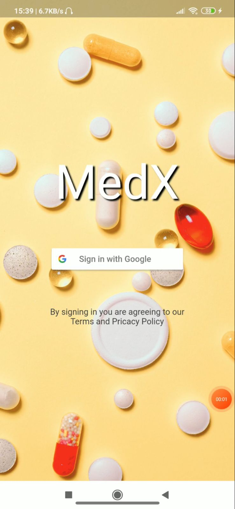
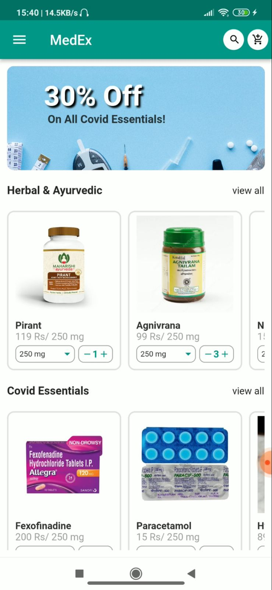
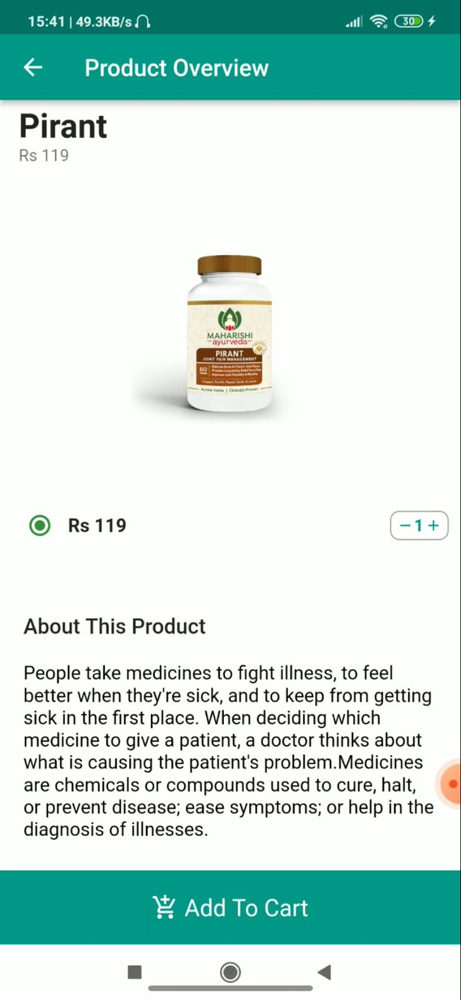
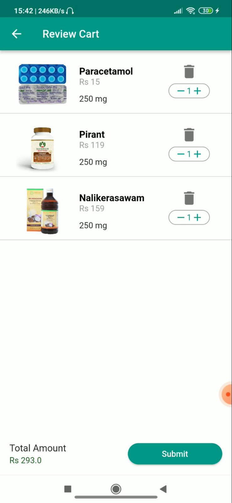
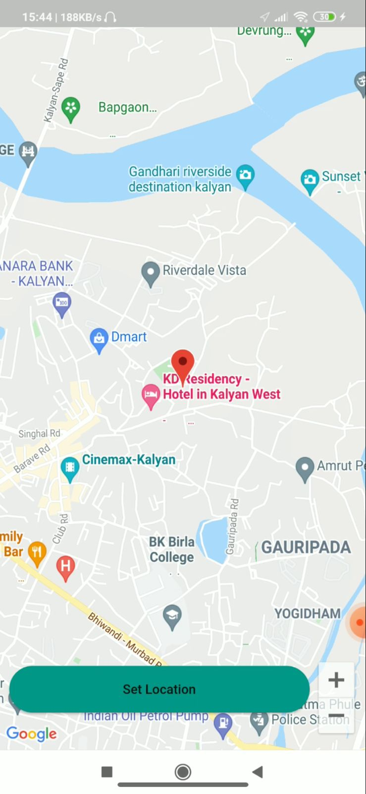
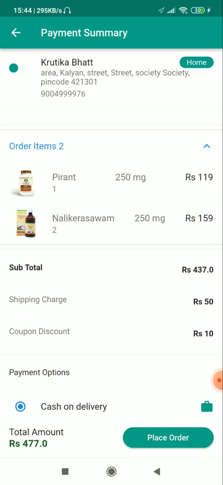
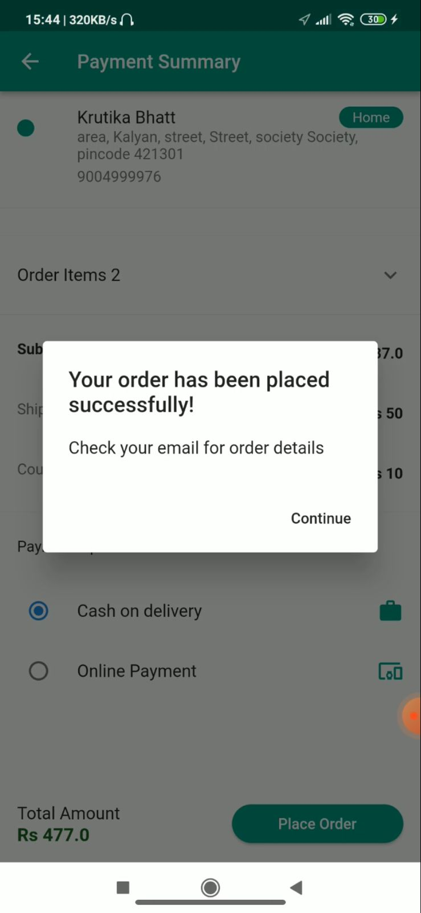

<h1 align="center">MedEx</h1>

 

 

 

---
<h2><strong>About</h2></strong>

COVID-19 pandemic wreaked havoc, pushing people into their homes for the longest period of time. This made it exceedingly difficult to step out and purchase medicines from the store as and when required. 

Not everybody lives close to a medical shop or pharmacy and hence, for them traveling miles to go and get medicines is truly a daunting task. The need of waiting for your turn in long queues or especially driving all the way to the store, especially for elderly people can become really inconvenient. 

"MedEx” is a medicine-delivery based mobile application, providing users the convenience of ordering over-the-counter medicines as well as medicines prescribed by a doctor and getting them delivered at their doorstep whenever they desire.

---

<h2><strong>Features</h2></strong>

* Account Authentication With Google Sign-In

* Select Through All Available Medicines From Different Categories 

* Easy Navigation & Detailed product Overview

* Seamless Search & Add To Cart Options​

* Update/Delete Cart Items

* View Profile & Upadate It Anytime

* Add Delivery Address With Google Maps

* Payment & Check-Out

---

<h2><strong>Screenshots</strong></h2>
 

<h3>Sign-In</h3>

  
<h3>Home</h3>

  
<h3>Product Overview</h3>

  
<h3>Product Cart</h3>

  
<h3>Address Using Google Maps</h3>

  
<h3>Payment</h3>

  
<h3>Check-Out</h3>

  

---

 
<h2 align="center"><b>DEVELOPED BY</b></h2> 

